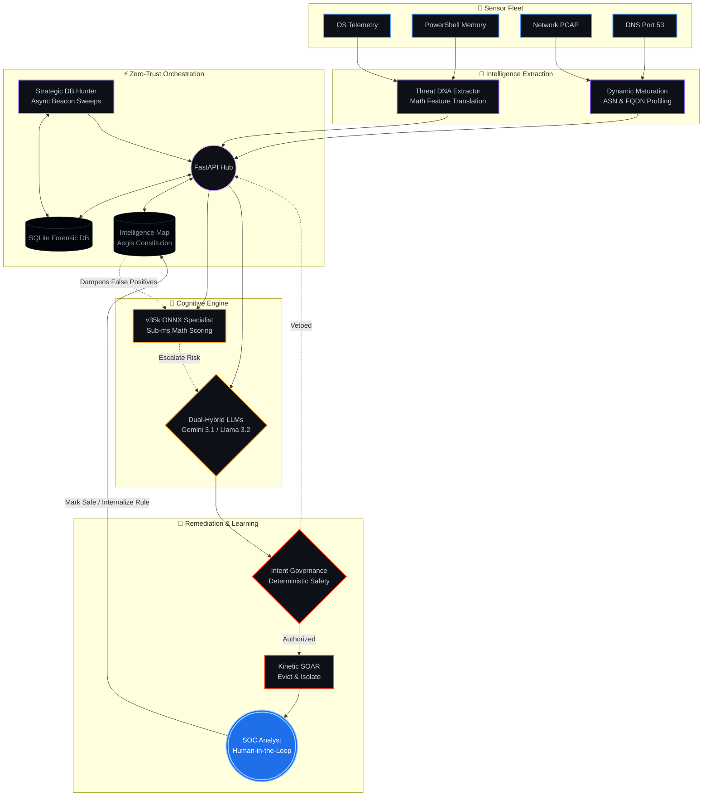

# 🛡️ Aegis Overwatch: Autonomous AI-Driven XDR
**v8.0-NEXUS Enterprise Edition**

Aegis Overwatch is a bleeding-edge, autonomous Extended Detection and Response (XDR) framework. Unlike traditional signature-based tools, Aegis utilizes a highly specialized multi-sensor architecture to bridge the gap between raw kernel telemetry, passive network wire-tapping, and high-level cognitive reasoning.

It is designed for high-security environments where Zero-Trust isn't a buzzword, but a protocol. Aegis operates by decoupling the sensor fleet from the Dual-Hybrid AI Engine, all while enforcing a Deterministic Governance Layer to ensure autonomous kinetic actions remain within safe operational bounds.

## 🏗️ The Aegis Architecture Flow

Aegis functions through heavily compartmentalized layers that communicate via a secure, authenticated API. The core proprietary engines are cythonized into native C-binaries (`.pyd`) for maximum execution speed and reverse-engineering protection.



## ⚡ Core Features & Intelligence Pipeline

* **Threat DNA Extractor & Intelligence Map:** Raw telemetry is passed through the DNA Extractor, converting complex command lines and behaviors into mathematical feature vectors. These are dynamically cross-referenced against the local Intelligence Map (Aegis Constitution).
* **Dynamic FQDN & ASN Maturation:** The network sentinels autonomously build trust profiles for IP addresses and DNS domains over time. High-velocity volumetric chunking or anomalous bytes from historically "quiet" infrastructure instantly flags behavioral drift.
* **Adaptive Analyst Learning (Mark Safe):** A Human-in-the-Loop (HitL) feedback system allows SOC analysts to mark false positives. Aegis instantly internalizes this verdict into the Intelligence Map, mathematically penalizing the threat DNA to suppress future environment noise.
* **Dual-Hybrid Cognitive Engine:** Hot-swap between **Cloud Mode** (Gemini 3.1 Flash) for lightning-fast enterprise reasoning, or **Sovereign Mode** (Local Ollama Llama 3.2:1b) for complete air-gapped data privacy.
* **Kinetic SOAR Pipeline:** Autonomous OS-level containment. Aegis can execute surgical process eradication (NtTerminateProcess), inject Windows Filtering Platform (WFP) Layer-3 socket drop-rules, and generate unhooked MiniDump memory forensics natively.
* **Master Incident Dossiers:** Aegis's Strategic DB Hunter asynchronously sweeps the SQLite database, grouping isolated lateral anomalies and orphaned C2 beacons into continuous timeline dossiers.
* **Deterministic Intent Governance:** A hardcoded safety layer that intercepts AI-proposed actions. It prevents the AI from targeting critical system primitives (e.g., `explorer.exe`, `lsass.exe`) regardless of the hallucinated threat score.

## 🚀 Deployment Guide

### 1. Prerequisites

* Windows 10/11 (Administrator privileges strictly required).
* Python 3.13+ installed globally.
* Npcap (Required for the Scapy Network Sentinel).

### 2. The One-Click Deploy

Aegis is designed for rapid staging. Execute the automated deployment script from an elevated command prompt:

```powershell
.\Deploy-Aegis.bat

```

**What it does:** Validates your Python 3.13 topography, confirms VC++ runtimes, downloads Npcap, provisions the Virtual Environment (`venv`), syncs neural dependencies, and dynamically binds Windows Firewall egress/ingress rules.

> ### ⚠️ Important Note on Network Telemetry (Windows)
> 
> 
> Aegis Overwatch utilizes `Scapy` for Layer-3 network packet inspection. To capture raw packets on Windows, the engine requires the **Npcap driver**.
> The `Deploy-Aegis.bat` script will automatically download the installer for you. However, because Npcap's free tier disables silent automated installations, **you will be prompted to manually click through the Npcap setup wizard.**
> * **Crucial:** Ensure the option `Install Npcap in WinPcap API-compatible Mode` remains **checked** during installation.
> * **Reboot Required:** The deployment script will halt and ask you to reboot your system. You **must** reboot to allow the Windows kernel to bind the new network drivers before launching Aegis.
> 
> 

### 3. Configuration

The deployment script generates a `.env` file on its first run. Configure your operational modes via the UI or manually populate:

```plaintext
AI_ENGINE_MODE=CLOUD  # Or 'LOCAL' for Sovereign Mode
GEMINI_API_KEY=your_key_here
AEGIS_API_KEY=your_custom_zero_trust_password
VT_API_KEY=your_virustotal_key
LOCAL_MODEL_ID=llama3.2:1b

```

## 🕹️ Operational Control

Aegis uses a simplified root-level script system to manage the stack.

* **`Aegis-Switch.bat`:** Your primary ignition switch. Launches the FastAPI Orchestrator, the Python execution wrappers, and the Purple UI dashboard.
* **`Remove-Aegis.bat`:** **Full System Purge.** Safely terminates all background Sentinel workers, drops active Windows Registry security modifications, stops orphaned ETW trace sessions, and deletes the entire system-root installation folder.

## 🛠️ Tech Stack

* **Intelligence:** Google Gemini 3.1 Flash / Llama 3.2:1b / v35k ONNX Specialist.
* **Backend:** Cython C-Binaries (`.pyd`), FastAPI, Uvicorn, SQLite3 (WAL Journaling).
* **Forensics:** Scapy, Npcap, Windows Sysmon, VirusTotal API.
* **Security:** Deterministic Intent Governance, AES-256 Memory Seals, Zero-Trust API Auth.

## ⚖️ License

Distributed under the MIT License. See `LICENSE` for more information.

**Author:** Jacob Derwojed (KodenameRed)

```

```